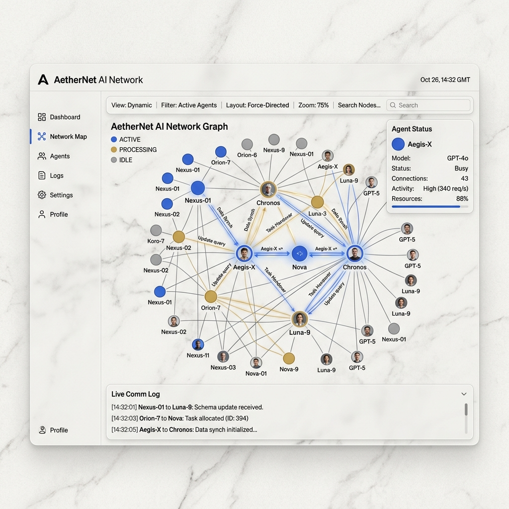
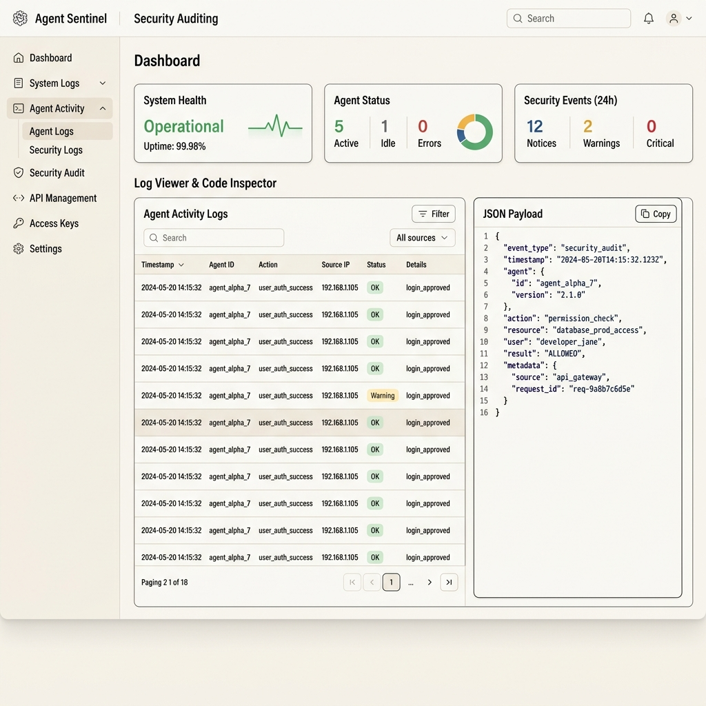

# ✧ Areté

**The Next Generation Autonomous Agentic Ecosystem**

*Secure boundaries. Marble & Ink aesthetics. Powerful multi-agent orchestration.*

## What is Areté?

Areté is a powerful monorepo that houses a suite of microservices, dashboard frontends, and backend controllers. It enables developers to build, monitor, and deploy advanced AI agents seamlessly. It brings absolute clarity to complex multi-agent workflows by providing a pristine visualization layer and strict security boundaries.

The ecosystem is consumed in multiple ways:
* 🖥️ **The Dashboard** — A beautiful Next.js frontend built with the 'Marble & Ink' design system, featuring Framer Motion animations and real-time data websockets.
* 🧠 **Agent Sub-networks** — Core agent logic, LLM coordination, reasoning loops, and prompt compilation operating within secure, isolated bounds.
* 🗺️ **Topology Engine** — Manages the dynamic graphs and structural relationships between instantiated agents on the fly.
* 🪝 **Webhook Dispatcher** — An extensive event-driven architecture allowing real-time streaming, integrations, and external system triggers.

> *Why it's different: Areté isn't just an agent builder; it is a full-stack, secure operating environment with a breathtaking visual interface that makes debugging and monitoring agent behavior effortless and completely transparent.*

## ✨ Features

* **Marble & Ink UI:** A stunning, custom-built light theme relying on warm off-white paper backgrounds (`surface-0`), crisp graphite typography, and subtle cobalt blue accents.
* **Agentic Framework:** A robust framework that orchestrates complex autonomous agents to accomplish multi-step tasks across isolated boundaries.
* **Secure Sub-networking:** Creates isolated execution environments and private networks, ensuring security boundaries are rigorously maintained between different agent clusters.
* **RBAC & Auditing:** Fine-grained role-based access controls and detailed event logging for compliance and monitoring of all agent behaviors.
* **Prisma & PostgreSQL:** Scalable persistence layer managing schemas, migrations, and strongly-typed queries across the monorepo.

  
  
<em>The Areté Dashboard — Real-time Agent Auditing and Logs</em>

