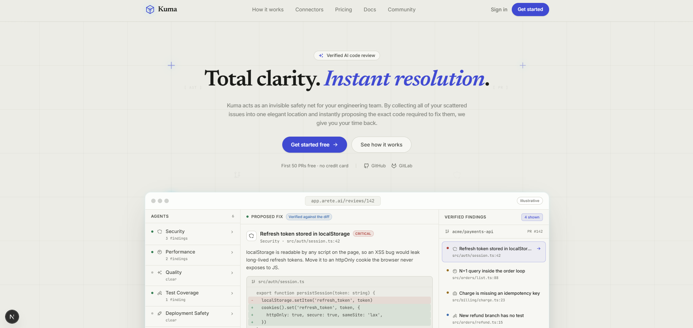
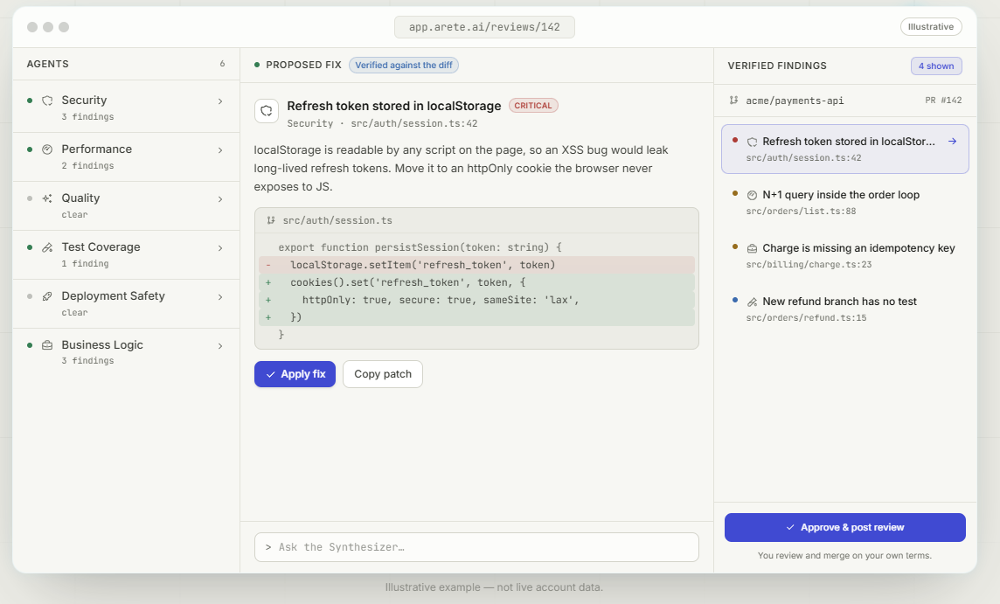
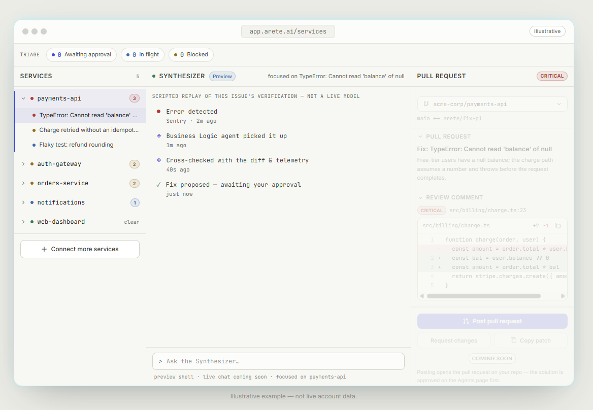

# ✧ Areté

**The Next Generation Autonomous Agentic Ecosystem**

*Secure boundaries. Marble & Ink aesthetics. Powerful multi-agent orchestration.*

## What is Areté?

Areté is a powerful monorepo that houses a suite of microservices, dashboard frontends, and backend controllers. It enables developers to build, monitor, and deploy advanced AI agents seamlessly. It brings absolute clarity to complex multi-agent workflows by providing a pristine visualization layer and strict security boundaries.

The ecosystem is consumed in multiple ways:
* 🖥️ **The Dashboard** — A beautiful frontend built with the 'Marble & Ink' design system, featuring fluid animations and real-time data websockets.
* 🧠 **Agent Sub-networks** — Core agent logic, LLM coordination, reasoning loops, and prompt compilation operating within secure, isolated bounds.
* 🗺️ **Topology Engine** — Manages the dynamic graphs and structural relationships between instantiated agents on the fly.
* 🪝 **Webhook Dispatcher** — An extensive event-driven architecture allowing real-time streaming, integrations, and external system triggers.

> *Why it's different: Areté isn't just an agent builder; it is a full-stack, secure operating environment with a breathtaking visual interface that makes debugging and monitoring agent behavior effortless and completely transparent.*

## ✨ Features

* **Marble & Ink UI:** A stunning, custom-built light theme relying on warm off-white paper backgrounds (`surface-0`), crisp graphite typography, and subtle cobalt blue accents.
* **Agentic Framework:** A robust framework that orchestrates complex autonomous agents to accomplish multi-step tasks across isolated boundaries.
* **Secure Sub-networking:** Creates isolated execution environments and private networks, ensuring security boundaries are rigorously maintained between different agent clusters.
* **RBAC & Auditing:** Fine-grained role-based access controls and detailed event logging for compliance and monitoring of all agent behaviors.
* **Scalable Persistence:** Robust database layer managing schemas, migrations, and strongly-typed queries across the entire ecosystem.

  
     
   
  
<em>The Areté Dashboard — Real-time Agent Auditing and Logs</em>

## 🏗️ System Architecture & Engineering

Areté is engineered from the ground up for massive scalability, strict security boundaries, and real-time observability across autonomous agents. 

### System Domains
- **Visualization & Control (Dashboard):** A real-time, websocket-driven interface that provides full transparency into agent reasoning, enabling operators to inspect topologies, active traces, and historical logs.
- **Agent Orchestration Services:** High-performance routing clusters optimized for managing concurrent reasoning loops, LLM load balancing, and executing multi-step agentic plans.
- **Asynchronous Job Dispatch:** An event-driven queueing architecture that handles secure incoming/outgoing webhooks, offloading heavy async computational tasks without blocking the main event loops.
- **Relational Persistence:** A strongly-typed database layer ensuring safe data interactions, managing relational schemas for thousands of concurrent autonomous tasks.

### Security & Authentication
- **Zero-Trust Internal Token Exchange:** Service-to-service communication is secured via short-lived, dynamically rotated JWT tokens. Every internal hop (e.g., from an Agent process back to the Dashboard for memory write-backs) is cryptographically verified.
- **RBAC & Tenancy:** Strict tenant isolation at the database layer ensuring that platform-level operational data and tenant-level LLM context are completely partitioned.
- **Encrypted Secrets:** External API keys (like third-party integrations or LLM provider credentials) are strictly encrypted at rest.

### Unified Observability
We run a world-class, production-grade observability pipeline designed specifically for autonomous AI workloads:
- **Distributed Tracing:** Integrated deeply into every service layer, allowing for the tracking of request flows from the initial webhook trigger down to the individual LLM generation.
- **High-Velocity Analytics:** Telemetry is forwarded into a high-throughput analytic engine for blistering-fast querying, and traces are deep-linked to instantly resolve failing generations and latency anomalies.
- **Automated Alerting:** Dedicated monitoring daemons independently track failure rates across agent queues and API response times, immediately alerting on degraded external model performance.